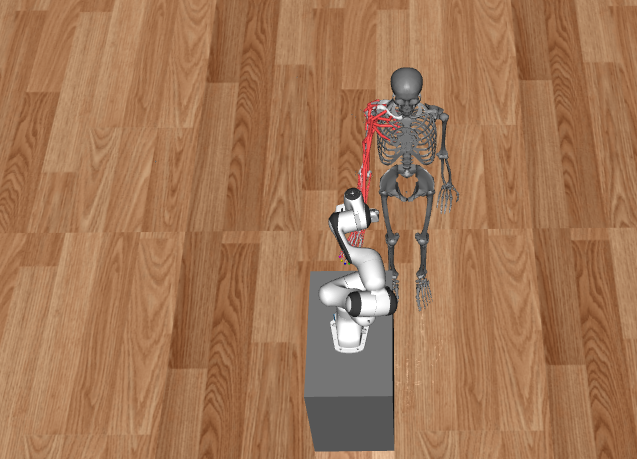
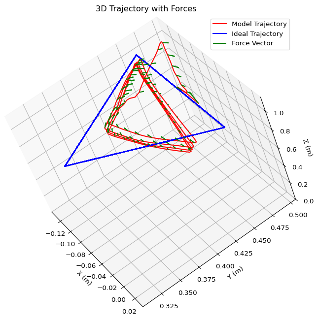

# Usage Instructions

Clone the repository:

```bash
git clone https://github.com/opfernandez/panda_myoarm.git
cd panda_myoarm
python3 -m venv venv
source venv/bin/activate
git submodule init
git submodule update --remote --merge
pip3 install -r requirements.txt
```

<p align="center">
  
</p>

## Launch Training
On one terminal, we launch the SB3 part, the DRL algorithm that infers actions from provided observations:
```bash
cd dm_robotics_panda/examples/
python3 rl_side_panda_myoarm.py -p <port>
```

On another terminal, we launch the simulation environment where the actions are executed and the observations are generated:
```bash
python3 agent_side_panda_myoarm.py -p <port>  
```

If you want to monitor training:
```bash
tensorboard --logdir ./train_logs --host 0.0.0.0
```

After training ends or you decide to finish it, you will find your checkpoints under the `/checkpoints` directory.

## Testing Your Model
```bash
python3 test_trained_DRL_model.py -m <.zip model under checkpoints dir> -t <trajectory to follow>
```
This will save forces, torques, end-effector velocities, and trajectory data in different `.csv` files so you can plot and inspect the data. Also available trajectories are `h-square`, `ah-square`, `h-triangle`, `ah-triangle`, `h-circle`, `ah-circle`, `h-pentagon`, `ah-pentagon`.

## Inspecting Results
```bash
python3 plot_data.py
```
This script reads data from CSV files generated by the test_trained_DRL_model.py script and plots various metrics such as trajectory, forces, torques, and velocities. It also plots forces over the trajectory for a 3D visualization. You can expect plots like the following one

<p align="center">
  
</p>