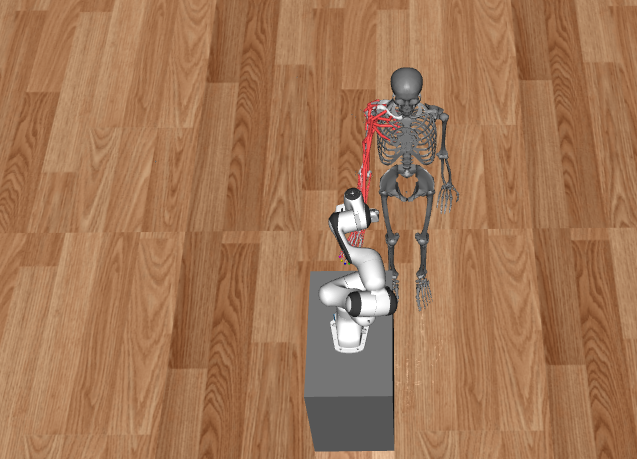

# Usage Instructions

Clone the repository:

```bash
git clone https://github.com/opfernandez/panda_myoarm.git
cd panda_myoarm
git submodule init
git submodule update
pip3 install -r requirements.txt
```

<p align="center">
  
</p>

## Launch Training
On one terminal:
```bash
python3 SBCustomEnv_v3.py -p <port>
```

On another terminal:
```bash
python3 CustomAgent_v3.py -p <port> -i <your.machine.ip.address>
```

If you want to monitor training:
```bash
tensorboard --logdir ./train_logs --host 0.0.0.0
```

After training ends or you decide to finish it, you will find your checkpoints under the `/checkpoints` directory.

## Testing Your Model
```bash
python3 test_model_env.py -m <.zip model under checkpoints dir>
```
This will save forces, torques, end-effector velocities, and trajectory data in different `.csv` files so you can plot and inspect the data.

## Inspecting Results
```bash
python3 test_traj_plot.py
```
This script only plots trajectory information. The script for plotting forces, torques, and end-effector velocities will be uploaded soon!